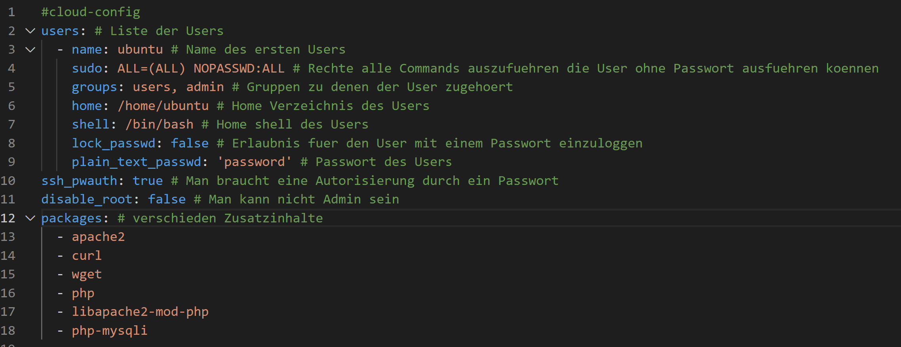
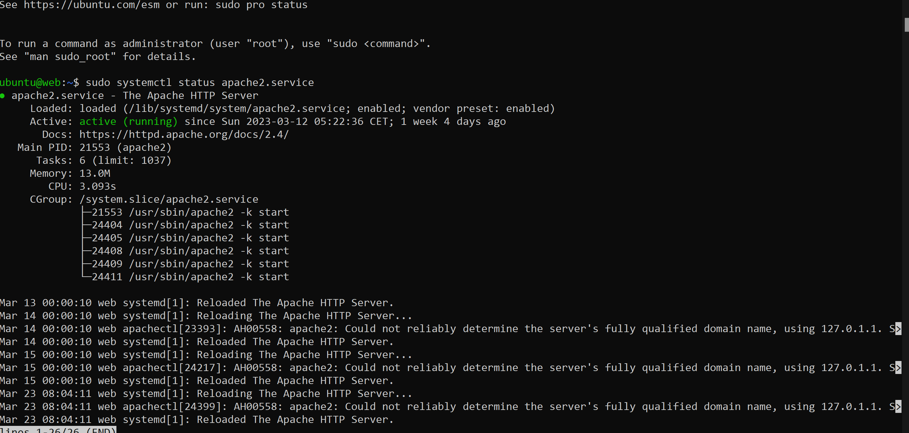
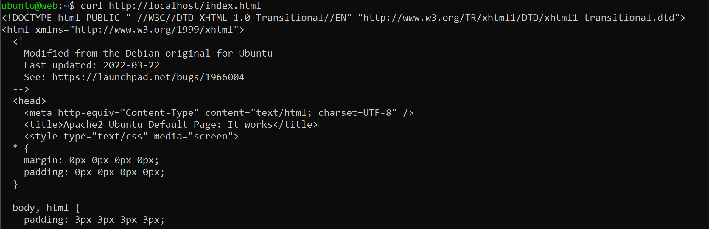

### KN02
#### A

#### B

#### C

##### The Code
`#cloud-config
users: # Liste der Users
  - name: ubuntu # Name des ersten Users
    sudo: ALL=(ALL) NOPASSWD:ALL # Rechte alle Commands auszufuehren die User ohne Passwort ausfuehren koennen
    groups: users, admin # Gruppen zu denen der User zugehoert
    home: /home/ubuntu # Home Verzeichnis des Users
    shell: /bin/bash # Home shell des Users
    lock_passwd: false # Erlaubnis fuer den User mit einem Passwort einzuloggen
    plain_text_passwd: 'password' # Passwort des Users
ssh_pwauth: true # Man braucht eine Autorisierung durch ein Passwort
disable_root: false # Man kann nicht Admin sein
packages: # verschieden Zusatzinhalte
  - apache2 
  - curl 
  - wget 
  - php 
  - libapache2-mod-php 
  - php-mysqli
 `
